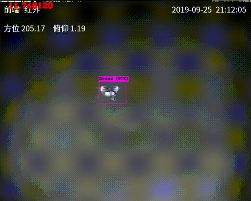
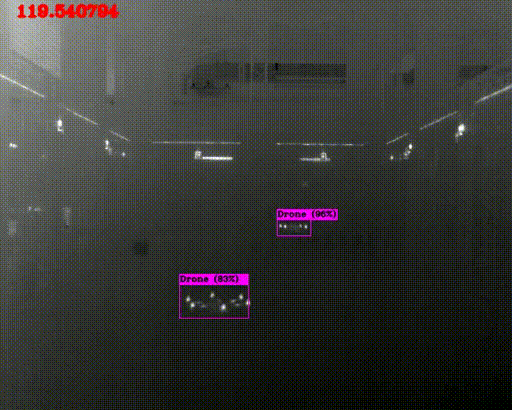
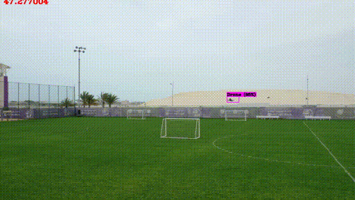

# Drone_Detection
Drone Detection Based on Yolo and optimized with TKDNN and TensorRT

This Drone Detector is based on Darknet([YOLO](https://github.com/AlexeyAB/darknet/)) and under process.
This detector works as a part in a long-term drone tracking system. It works both on visual domain and thermal domain

## Demo
#### Thermal Domain


#### Visual Domain


## Speed comparison 

Experiments on RTX 2060
Resolution|Config|Speed,fps|TkDNN TensorRT speedup(fp16),fps
---|:--:|---:|---:
416*416|yolov4|82|162
512*512|yolov4|69|134
608*608|yolov4|53|103
416*416|yolov4tiny|300|790
512*512|yolov4tiny|140|-
608*608|yolov4tiny|89|-
416*416(cpu)|yolov4tiny|4|42


The library is compiled as .so file which can be used in c++(./src/main) or python environment(./python)
The code is been optimized.


## Instruction
Now It support CPU or GPU mode with sperate file "libdarknet.so" and "libdarknetcpu.so"
To compile the demo:

1. Download the weights file from googledrive[link](https://drive.google.com/drive/folders/1jp-W_y5BAUUbJAASKH_W8ez-G9OZIXXd?usp=sharing) and put them under weights folder

2. Configuration
```shell
# set the path for configuration, weights, videos in your main.cpp file

string cfgfile = "../../cfg/yolov4-tiny-3l-drone.cfg";
string weightfile = "../../weights/yolov4-tiny-3l-drone.weights";
VideoCapture capture("../../demo/cut_drone.mp4");
ifstream classNamesFile("../../cfg/drone.names");
```

3. Compile
``` shell
cd src
mkdir build && cd build
cmake ..
make
```
4. The excuate file is under build folder `./YoloDroneDetection`

## TODO

+ C++ multithread and memory safe 
+ Intergrate tracking under C++ framework
+ Provide TKDNN optimized model and test script

